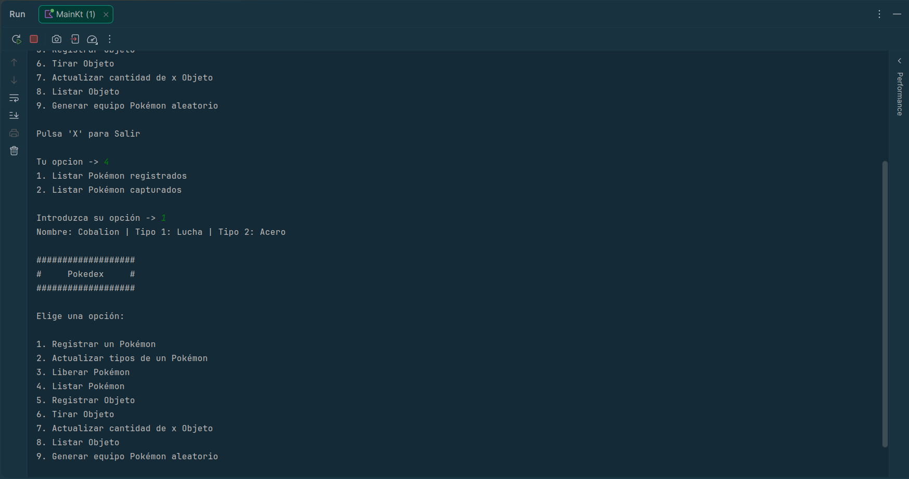
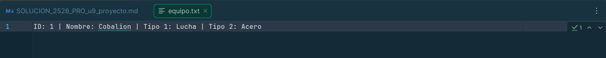
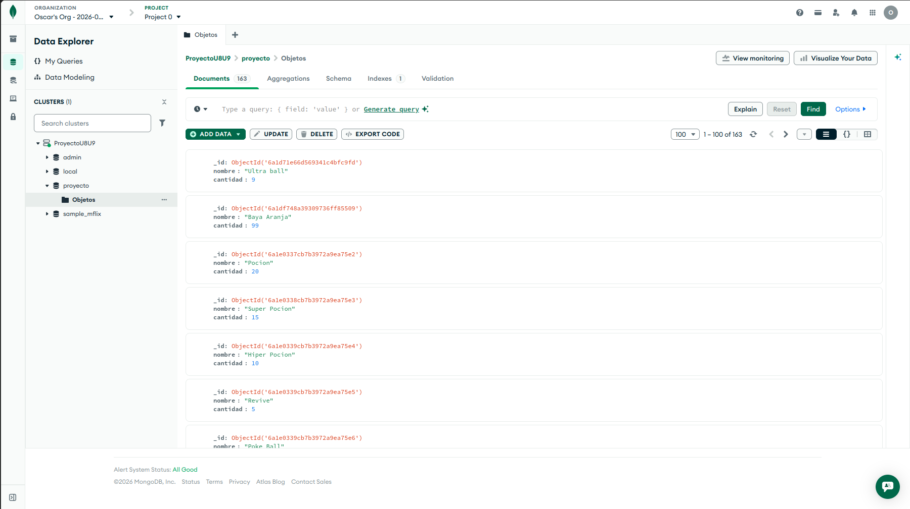
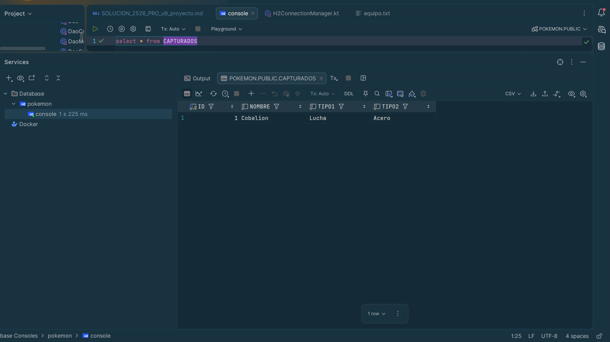

# Solución del proyecto

- **Proyecto:** <!-- Nombre del proyecto --> Gestion de Pokemon y Objetos
- **Alumno/a:** <!-- Nombre y apellidos --> Óscar García Jaén
- **Repositorio:** <!-- URL del repositorio --> https://github.com/IES-Rafael-Alberti/2526-u8u9-9-1-proyectolibre-oscargarciajaen

## 1. Resumen del proyecto

- **Problema que resuelve:** Te permite mantener un control de los Pokemon capturados, avistados y objetos adquiridos, ademas de la creacion de generar equipos aleatorios a partir de los Pokemon captruados.
- **Usuarios principales:** Principalmente, este programa va dirigidos a los jugadores de la franquicia Pokémon.
- **Funcionalidades principales:**
  - Registrar Pokémon : https://github.com/IES-Rafael-Alberti/2526-u8u9-9-1-proyectolibre-oscargarciajaen/blob/3a86d1c2d439da4bf06137cc6fa5c1e07eccf904/src/main/kotlin/repository/Dao/DaoSQL.kt#L15-L63
  - Actualizar Pokémon : https://github.com/IES-Rafael-Alberti/2526-u8u9-9-1-proyectolibre-oscargarciajaen/blob/3a86d1c2d439da4bf06137cc6fa5c1e07eccf904/src/main/kotlin/repository/Dao/DaoSQL.kt#L174-L226
  - Eliminar Pokémon : https://github.com/IES-Rafael-Alberti/2526-u8u9-9-1-proyectolibre-oscargarciajaen/blob/3a86d1c2d439da4bf06137cc6fa5c1e07eccf904/src/main/kotlin/repository/Dao/DaoSQL.kt#L65-L86
  - Listar Pokémon : https://github.com/IES-Rafael-Alberti/2526-u8u9-9-1-proyectolibre-oscargarciajaen/blob/3a86d1c2d439da4bf06137cc6fa5c1e07eccf904/src/main/kotlin/repository/Dao/DaoSQL.kt#L88-L170
  - Registrar Objeto : https://github.com/IES-Rafael-Alberti/2526-u8u9-9-1-proyectolibre-oscargarciajaen/blob/3a86d1c2d439da4bf06137cc6fa5c1e07eccf904/src/main/kotlin/repository/Dao/DaoMongo.kt#L16-L35
  - Actualizar Cantidad de Objeto : https://github.com/IES-Rafael-Alberti/2526-u8u9-9-1-proyectolibre-oscargarciajaen/blob/3a86d1c2d439da4bf06137cc6fa5c1e07eccf904/src/main/kotlin/repository/Dao/DaoMongo.kt#L55-L74
  - Listar objetos : https://github.com/IES-Rafael-Alberti/2526-u8u9-9-1-proyectolibre-oscargarciajaen/blob/3a86d1c2d439da4bf06137cc6fa5c1e07eccf904/src/main/kotlin/repository/Dao/DaoMongo.kt#L76-L92
  - Eliminar Objetos : https://github.com/IES-Rafael-Alberti/2526-u8u9-9-1-proyectolibre-oscargarciajaen/blob/3a86d1c2d439da4bf06137cc6fa5c1e07eccf904/src/main/kotlin/repository/Dao/DaoMongo.kt#L37-L53
  - Crear Equipo : https://github.com/IES-Rafael-Alberti/2526-u8u9-9-1-proyectolibre-oscargarciajaen/blob/3a86d1c2d439da4bf06137cc6fa5c1e07eccf904/src/main/kotlin/service/PokedexService.kt#L180-L215
- **Entidades principales:** 
  - Pokemon (data class) - representa un Pokémon con nombre, tipo1, tipo2 e id opcional : https://github.com/IES-Rafael-Alberti/2526-u8u9-9-1-proyectolibre-oscargarciajaen/blob/3a86d1c2d439da4bf06137cc6fa5c1e07eccf904/src/main/kotlin/model/Pokemon.kt#L3-L29
  - Objeto (data class) - representa un objeto con nombre y cantidad : https://github.com/IES-Rafael-Alberti/2526-u8u9-9-1-proyectolibre-oscargarciajaen/blob/3a86d1c2d439da4bf06137cc6fa5c1e07eccf904/src/main/kotlin/model/Objeto.kt#L3-L14
  - Tipo (enum) - enum con los 18 tipos de Pokémon + False para los Pokémon con 1 solo tipo : https://github.com/IES-Rafael-Alberti/2526-u8u9-9-1-proyectolibre-oscargarciajaen/blob/3a86d1c2d439da4bf06137cc6fa5c1e07eccf904/src/main/kotlin/model/Tipo.kt#L3-L27
- **Estructura del proyecto:** 
  - model/ - clases del dominio (Pokemon, objeto, tipo) : https://github.com/IES-Rafael-Alberti/2526-u8u9-9-1-proyectolibre-oscargarciajaen/tree/main/src/main/kotlin/model
  - respository/Dao/ - capa de acceso a datos con genéricos (Dao<T, ID> abstracto, DaoSQL, DaoMongo, DaoCsv, DaoTxt) : https://github.com/IES-Rafael-Alberti/2526-u8u9-9-1-proyectolibre-oscargarciajaen/tree/main/src/main/kotlin/repository/Dao
  - repository/ - interfaces de repositorio (IRepositorySQL), IRepositoryMongo, IRepositoryTxt) y sus implementaciones (RepositorioSQL, RepositorioMongo, RepositorioTxt) : https://github.com/IES-Rafael-Alberti/2526-u8u9-9-1-proyectolibre-oscargarciajaen/tree/main/src/main/kotlin/repository
  - service/ - logica de negocio (PokedexService) : https://github.com/IES-Rafael-Alberti/2526-u8u9-9-1-proyectolibre-oscargarciajaen/tree/main/src/main/kotlin/service
  - app/ - interfaz de consola (Console) : https://github.com/IES-Rafael-Alberti/2526-u8u9-9-1-proyectolibre-oscargarciajaen/tree/main/src/main/kotlin/app
  - util/ - gestores de conexión (H2ConnectionManager, MongoConecctionManager) : https://github.com/IES-Rafael-Alberti/2526-u8u9-9-1-proyectolibre-oscargarciajaen/tree/main/src/main/kotlin/util

## 2. Instalación y ejecución

```bash
# Comandos necesarios para ejecutar el proyecto
./run.sh
```

- **Requisitos previos:** JDK 21+, MongoDB Atlas (o instancia local) con cadena de conexión
- **Configuración necesaria:** El fichero `src/main/kotlin/data/txt/mongo_config.txt` debe contener la URI de conexión a MongoDB
- **Datos de prueba incluidos:** `src/main/kotlin/data/csv/objetos.csv` con 11 objetos en formato `nombre|cantidad`
- 
## 3. Diseño y modelo

- **clases principales:**
  - `Pokemon` (`model/Pokemon.kt`) – data class con nombre, tipo1, tipo2, id opcional : https://github.com/IES-Rafael-Alberti/2526-u8u9-9-1-proyectolibre-oscargarciajaen/blob/3a86d1c2d439da4bf06137cc6fa5c1e07eccf904/src/main/kotlin/model/Pokemon.kt#L3-L29
  - `Objeto` (`model/Objeto.kt`) – data class con nombre y cantidad : https://github.com/IES-Rafael-Alberti/2526-u8u9-9-1-proyectolibre-oscargarciajaen/blob/3a86d1c2d439da4bf06137cc6fa5c1e07eccf904/src/main/kotlin/model/Objeto.kt#L3-L14
  - `Tipo` (`model/Tipo.kt`) – enum con 19 valores (Acero, Agua, ..., False): https://github.com/IES-Rafael-Alberti/2526-u8u9-9-1-proyectolibre-oscargarciajaen/blob/3a86d1c2d439da4bf06137cc6fa5c1e07eccf904/src/main/kotlin/model/Tipo.kt#L3-L27
  - `Console` (`app/Console.kt`) – object singleton que maneja toda la interacción por consola: menús, lectura y validación de entrada : https://github.com/IES-Rafael-Alberti/2526-u8u9-9-1-proyectolibre-oscargarciajaen/blob/3a86d1c2d439da4bf06137cc6fa5c1e07eccf904/src/main/kotlin/app/Console.kt#L3-L272
  - `PokedexService` (`service/PokedexService.kt`) – object singleton que orquesta toda la lógica de la aplicación : https://github.com/IES-Rafael-Alberti/2526-u8u9-9-1-proyectolibre-oscargarciajaen/blob/3a86d1c2d439da4bf06137cc6fa5c1e07eccf904/src/main/kotlin/service/PokedexService.kt#L3-L216
  - `Dao<T, ID>` (`repository/Dao/Dao.kt`) – clase abstracta genérica base para todos los DAOs : https://github.com/IES-Rafael-Alberti/2526-u8u9-9-1-proyectolibre-oscargarciajaen/blob/3a86d1c2d439da4bf06137cc6fa5c1e07eccf904/src/main/kotlin/repository/Dao/Dao.kt#L3-L16
  - `DaoSQL` (`repository/Dao/DaoSQL.kt`) – CRUD para H2 con PreparedStatement : https://github.com/IES-Rafael-Alberti/2526-u8u9-9-1-proyectolibre-oscargarciajaen/blob/3a86d1c2d439da4bf06137cc6fa5c1e07eccf904/src/main/kotlin/repository/Dao/DaoSQL.kt#L3-L227
  - `DaoMongo` (`repository/Dao/DaoMongo.kt`) – CRUD para MongoDB con `insertOne`, `deleteOne`, `updateOne`, `find` : https://github.com/IES-Rafael-Alberti/2526-u8u9-9-1-proyectolibre-oscargarciajaen/blob/3a86d1c2d439da4bf06137cc6fa5c1e07eccf904/src/main/kotlin/repository/Dao/DaoMongo.kt#L3-L93
  - `DaoCsv` (`repository/Dao/DaoCsv.kt`) – lectura de `objetos.csv` : https://github.com/IES-Rafael-Alberti/2526-u8u9-9-1-proyectolibre-oscargarciajaen/blob/3a86d1c2d439da4bf06137cc6fa5c1e07eccf904/src/main/kotlin/repository/Dao/DaoCsv.kt#L3-L44
  - `DaoTxt` (`repository/Dao/DaoTxt.kt`) – lectura/escritura de `equipo.txt` y `mongo_config.txt` : https://github.com/IES-Rafael-Alberti/2526-u8u9-9-1-proyectolibre-oscargarciajaen/blob/3a86d1c2d439da4bf06137cc6fa5c1e07eccf904/src/main/kotlin/repository/Dao/DaoTxt.kt#L3-L77
  - `H2ConnectionManager` (`util/H2ConnectionManager.kt`) – conexión H2 y creación de tablas : https://github.com/IES-Rafael-Alberti/2526-u8u9-9-1-proyectolibre-oscargarciajaen/blob/3a86d1c2d439da4bf06137cc6fa5c1e07eccf904/src/main/kotlin/util/H2ConnectionManager.kt#L3-L64
  - `MongoConecctionManager` (`util/MongoConecctionManager.kt`) – conexión a MongoDB Atlas : https://github.com/IES-Rafael-Alberti/2526-u8u9-9-1-proyectolibre-oscargarciajaen/blob/3a86d1c2d439da4bf06137cc6fa5c1e07eccf904/src/main/kotlin/util/MongoConecctionManager.kt#L3-L52
- **Relaciones importantes:** Herencia de `Dao<T, ID>` hacia `DaoSQL`, `DaoMongo`, `DaoCsv`, `DaoTxt`. Interfaces `IRepositorySQL`, `IRepositoryMongo`, `IRepositoryTxt` implementadas por `RepositorioSQL`, `RepositorioMongo`, `RepositorioTxt` respectivamente.

- **Genéricos usados:** `Dao<T, ID>` como clase abstracta genérica donde `T` es la entidad e `ID` el tipo de identificador. `Console.mostrarTodos<T>(lista: List<T>)` como función genérica.

- **Colecciones usadas:**
  - `MutableList<Pokemon>` en `DaoSQL.listarPokemonRegistrados()` y `listarPokemonCapturados()` para resultados de consultas SQL
    - https://github.com/IES-Rafael-Alberti/2526-u8u9-9-1-proyectolibre-oscargarciajaen/blob/3a86d1c2d439da4bf06137cc6fa5c1e07eccf904/src/main/kotlin/repository/Dao/DaoSQL.kt#L96
    - https://github.com/IES-Rafael-Alberti/2526-u8u9-9-1-proyectolibre-oscargarciajaen/blob/3a86d1c2d439da4bf06137cc6fa5c1e07eccf904/src/main/kotlin/repository/Dao/DaoSQL.kt#L138
  - `MutableList<Objeto>` en `DaoCsv.leerObjetos()` y `DaoMongo.obtenerTodos()` para acumular resultados
    - https://github.com/IES-Rafael-Alberti/2526-u8u9-9-1-proyectolibre-oscargarciajaen/blob/3a86d1c2d439da4bf06137cc6fa5c1e07eccf904/src/main/kotlin/repository/Dao/DaoMongo.kt#L83
    - https://github.com/IES-Rafael-Alberti/2526-u8u9-9-1-proyectolibre-oscargarciajaen/blob/3a86d1c2d439da4bf06137cc6fa5c1e07eccf904/src/main/kotlin/repository/Dao/DaoCsv.kt#L20
  - `MutableList<Pokemon>` y `MutableList<Int>` en `PokedexService.crearEquipo()` para generar equipo aleatorio
    - https://github.com/IES-Rafael-Alberti/2526-u8u9-9-1-proyectolibre-oscargarciajaen/blob/3a86d1c2d439da4bf06137cc6fa5c1e07eccf904/src/main/kotlin/service/PokedexService.kt#L190
    - https://github.com/IES-Rafael-Alberti/2526-u8u9-9-1-proyectolibre-oscargarciajaen/blob/3a86d1c2d439da4bf06137cc6fa5c1e07eccf904/src/main/kotlin/service/PokedexService.kt#L197
  - `List<String>` en `Console.solicitarOpcion()` para opciones válidas del menú
    - https://github.com/IES-Rafael-Alberti/2526-u8u9-9-1-proyectolibre-oscargarciajaen/blob/3a86d1c2d439da4bf06137cc6fa5c1e07eccf904/src/main/kotlin/app/Console.kt#L18

- **Principios SOLID aplicados:**
  - **SRP:** `Console` solo gestiona I/O de usuario, `DaoSQL` solo operaciones SQL, `H2ConnectionManager` solo conexión/creación de tablas
  - **DIP:** `PokedexService` depende de las abstracciones `IRepositorySQL`, `IRepositoryMongo`, `IRepositoryTxt`, no de implementaciones concretas
  - **OCP:** Se puede añadir un nuevo tipo de persistencia sin modificar los DAOs existentes

- **Patrones de diseño:**
  - **DAO** – `Dao<T, ID>` y sus subclases (`DaoSQL`, `DaoMongo`, `DaoCsv`, `DaoTxt`) encapsulan el acceso a datos
  - **Repository** – `RepositorioSQL`, `RepositorioMongo`, `RepositorioTxt` median entre el servicio y los DAOs
  - **Singleton** – `Console` y `PokedexService` como `object` de Kotlin

## 4. Persistencia

### Ficheros

- **Ficheros usados:**
  - `objetos.csv` (`src/main/kotlin/data/csv/objetos.csv`) – leído por `DaoCsv.leerObjetos()` usando `useLines` 
    - objetos.csv : https://github.com/IES-Rafael-Alberti/2526-u8u9-9-1-proyectolibre-oscargarciajaen/blob/main/src/main/kotlin/data/csv/objetos.csv
    - DaoCsv : https://github.com/IES-Rafael-Alberti/2526-u8u9-9-1-proyectolibre-oscargarciajaen/blob/3a86d1c2d439da4bf06137cc6fa5c1e07eccf904/src/main/kotlin/repository/Dao/DaoCsv.kt#L12-L43
  - `equipo.txt` (`src/main/kotlin/data/txt/equipo.txt`) – creado por `DaoTxt.crear()`, escrito por `DaoTxt.guardar()` usando `writeText`
    - equipo.txt : https://github.com/IES-Rafael-Alberti/2526-u8u9-9-1-proyectolibre-oscargarciajaen/blob/main/src/main/kotlin/data/txt/equipo.txt
    - DaoTxt : https://github.com/IES-Rafael-Alberti/2526-u8u9-9-1-proyectolibre-oscargarciajaen/blob/3a86d1c2d439da4bf06137cc6fa5c1e07eccf904/src/main/kotlin/repository/Dao/DaoTxt.kt#L15-L54
  - `mongo_config.txt` (`src/main/kotlin/data/txt/mongo_config.txt`) – leído por `DaoTxt.leerConexionMongo()` usando `readLines()`
    - mongo_config.txt : https://github.com/IES-Rafael-Alberti/2526-u8u9-9-1-proyectolibre-oscargarciajaen/blob/main/src/main/kotlin/data/txt/mongo_config.txt
    - DaoTxt : https://github.com/IES-Rafael-Alberti/2526-u8u9-9-1-proyectolibre-oscargarciajaen/blob/7d842056bb0d2dcc54e9abbfca3a728a520eeee7/src/main/kotlin/repository/Dao/DaoTxt.kt#L56-L77
- **Errores controlados:** `DaoCsv` captura `Exception` genérica, `DaoTxt` captura `Exception` genérica
  - DaoCsv : https://github.com/IES-Rafael-Alberti/2526-u8u9-9-1-proyectolibre-oscargarciajaen/blob/7d842056bb0d2dcc54e9abbfca3a728a520eeee7/src/main/kotlin/repository/Dao/DaoCsv.kt#L27-L40
  - DaoTxt : https://github.com/IES-Rafael-Alberti/2526-u8u9-9-1-proyectolibre-oscargarciajaen/blob/7d842056bb0d2dcc54e9abbfca3a728a520eeee7/src/main/kotlin/repository/Dao/DaoTxt.kt#L45-L53
  
### MongoDB

- **Base de datos:** proyecto
- **Colecciones:** Objetos – documentos con `nombre` (String) y `cantidad` (Int)
- **Operaciones:** `DaoMongo.guardarObjeto()`, `DaoMongo.eliminarObjeto()`, `DaoMongo.actualizarCantidad()`, `DaoMongo.obtenerTodos()`
  - DaoMongo : https://github.com/IES-Rafael-Alberti/2526-u8u9-9-1-proyectolibre-oscargarciajaen/blob/7d842056bb0d2dcc54e9abbfca3a728a520eeee7/src/main/kotlin/repository/Dao/DaoMongo.kt#L10-L93
- **Clase responsable:** `DaoMongo` + `RepositorioMongo` delega en él; `MongoConecctionManager.obtenerMongoDB()` gestiona la conexión
  - DaoMongo : https://github.com/IES-Rafael-Alberti/2526-u8u9-9-1-proyectolibre-oscargarciajaen/blob/7d842056bb0d2dcc54e9abbfca3a728a520eeee7/src/main/kotlin/repository/Dao/DaoMongo.kt#L10-L93
  - RepositorioMongo : https://github.com/IES-Rafael-Alberti/2526-u8u9-9-1-proyectolibre-oscargarciajaen/blob/7d842056bb0d2dcc54e9abbfca3a728a520eeee7/src/main/kotlin/repository/RepositorioMongo.kt#L7-L53
  - MongoConnectionManager : https://github.com/IES-Rafael-Alberti/2526-u8u9-9-1-proyectolibre-oscargarciajaen/blob/7d842056bb0d2dcc54e9abbfca3a728a520eeee7/src/main/kotlin/util/MongoConecctionManager.kt#L11-L52

### Base de datos relacional (H2)

- **SGBD:** H2 en modo fichero (`jdbc:h2:file:./src/main/kotlin/data/bd/pokemon`)
- **Tablas:**
  - `CAPTURADOS` (id INT AUTO_INCREMENT PK, nombre VARCHAR, tipo1 VARCHAR, tipo2 VARCHAR)
  - `REGISTRADOS` (nombre VARCHAR PK, tipo1 VARCHAR, tipo2 VARCHAR)
- **Script SQL:** En `H2ConnectionManager.createTables()` con `CREATE TABLE IF NOT EXISTS`
  - https://github.com/IES-Rafael-Alberti/2526-u8u9-9-1-proyectolibre-oscargarciajaen/blob/7d842056bb0d2dcc54e9abbfca3a728a520eeee7/src/main/kotlin/util/H2ConnectionManager.kt#L38-L63
- **CRUD completo en DaoSQL:** `saveAvistado()`/`saveCaptura()`, `listarPokemonRegistrados()`/`listarPokemonCapturados()`, `update()`/`updateRegistrados()`, `liberarPokemonCapturado()`
  - DaoSql : https://github.com/IES-Rafael-Alberti/2526-u8u9-9-1-proyectolibre-oscargarciajaen/blob/7d842056bb0d2dcc54e9abbfca3a728a520eeee7/src/main/kotlin/repository/Dao/DaoSQL.kt#L9-L227
- **Consultas parametrizadas:** Todos los SQL usan `PreparedStatement` con `?` (ej. `INSERT INTO CAPTURADOS (nombre, tipo1, tipo2) VALUES (?, ?, ?)`)
  - Ejemplo función con consulta parametrizada : https://github.com/IES-Rafael-Alberti/2526-u8u9-9-1-proyectolibre-oscargarciajaen/blob/7d842056bb0d2dcc54e9abbfca3a728a520eeee7/src/main/kotlin/repository/Dao/DaoSQL.kt#L21-L38
- **Gestión de conexión:** `H2ConnectionManager.create()` abre la conexión, se pasa como parámetro a los métodos de `DaoSQL`, y se cierra al finalizar `PokedexService.ejecutar()`. Los `PreparedStatement` se cierran automáticamente con `.use {}`.
  - H2ConnectionManager : https://github.com/IES-Rafael-Alberti/2526-u8u9-9-1-proyectolibre-oscargarciajaen/blob/7d842056bb0d2dcc54e9abbfca3a728a520eeee7/src/main/kotlin/util/H2ConnectionManager.kt#L14-L31
  - PokedexService : https://github.com/IES-Rafael-Alberti/2526-u8u9-9-1-proyectolibre-oscargarciajaen/blob/7d842056bb0d2dcc54e9abbfca3a728a520eeee7/src/main/kotlin/service/PokedexService.kt#L19-L46

## 5. Validaciones y errores

- **Expresiones regulares:**
  - `^\d+$` en `Console.solicitarId()` – valida que el ID sea un número positivo. Válido: `"42"`, Inválido: `"-1"`, `"abc"`
  - solicitarId() : https://github.com/IES-Rafael-Alberti/2526-u8u9-9-1-proyectolibre-oscargarciajaen/blob/7d842056bb0d2dcc54e9abbfca3a728a520eeee7/src/main/kotlin/app/Console.kt#L90-L109
  - `^([1-9]|[1-9][0-9])$` en `Console.solicitarCantidad()` – valida cantidad entre 1 y 99. Válido: `"15"`, Inválido: `"0"`, `"100"`
  - solicitarCantidad() : https://github.com/IES-Rafael-Alberti/2526-u8u9-9-1-proyectolibre-oscargarciajaen/blob/7d842056bb0d2dcc54e9abbfca3a728a520eeee7/src/main/kotlin/app/Console.kt#L164-L182

- **Excepciones controladas:**
  - `SQLException` en `DaoSQL` – capturada en cada método, imprime mensaje de error y continúa 
    - DaoSql : https://github.com/IES-Rafael-Alberti/2526-u8u9-9-1-proyectolibre-oscargarciajaen/blob/36c2ca4817b8cbcc1361f6953f5af7bac421c7aa/src/main/kotlin/repository/Dao/DaoSQL.kt#L9-L227
  - `Exception` en `DaoCsv.leerObjetos()` – si falla la lectura del CSV, devuelve lista vacía
    - DaoCsv : https://github.com/IES-Rafael-Alberti/2526-u8u9-9-1-proyectolibre-oscargarciajaen/blob/36c2ca4817b8cbcc1361f6953f5af7bac421c7aa/src/main/kotlin/repository/Dao/DaoCsv.kt#L12-L44
  - `Exception` en `DaoTxt` – si falla la operación con ficheros, imprime error
    - DaoTxt : https://github.com/IES-Rafael-Alberti/2526-u8u9-9-1-proyectolibre-oscargarciajaen/blob/36c2ca4817b8cbcc1361f6953f5af7bac421c7aa/src/main/kotlin/repository/Dao/DaoTxt.kt#L15-L76
  - `Exception` en `DaoMongo` – capturada en cada operación e imprime error.
    - DaoMongo : https://github.com/IES-Rafael-Alberti/2526-u8u9-9-1-proyectolibre-oscargarciajaen/blob/36c2ca4817b8cbcc1361f6953f5af7bac421c7aa/src/main/kotlin/repository/Dao/DaoMongo.kt#L16-L92
  - `SQLException` en `H2ConnectionManager` – si falla la conexión, imprime error.
    - https://github.com/IES-Rafael-Alberti/2526-u8u9-9-1-proyectolibre-oscargarciajaen/blob/36c2ca4817b8cbcc1361f6953f5af7bac421c7aa/src/main/kotlin/util/H2ConnectionManager.kt#L7-L64

## 6. Pruebas y evidencias

- **Pruebas automatizadas:** 4 tests en `kotlin.test`
  - `PokemonTest` (3 tests): `toString` sin id, `toString` con id, `id` null tras crear
    - PokemonTest : https://github.com/IES-Rafael-Alberti/2526-u8u9-9-1-proyectolibre-oscargarciajaen/blob/36c2ca4817b8cbcc1361f6953f5af7bac421c7aa/src/test/kotlin/model/PokemonTest.kt#L7-L33
  - `ObjetoTest` (1 test): `toString` formateado
    - ObjetoTest : https://github.com/IES-Rafael-Alberti/2526-u8u9-9-1-proyectolibre-oscargarciajaen/blob/36c2ca4817b8cbcc1361f6953f5af7bac421c7aa/src/test/kotlin/model/ObjetoTest.kt#L6-L16
- **Datos de prueba:** `objetos.csv` con 11 líneas de objetos en formato `nombre|cantidad`
  - https://github.com/IES-Rafael-Alberti/2526-u8u9-9-1-proyectolibre-oscargarciajaen/blob/main/src/main/kotlin/data/csv/objetos.csv
- **Evidencia de ejecución:** 
  - 
- **Evidencia de ficheros:** 
  - 
- **Evidencia de MongoDB:** 
  - 
- **Evidencia de SQL:**
  - 
  
## 7. Refactorización, documentación y Git

- **Refactorizaciones aplicadas:** Division de la función ejecutar en un conjunto de subfunciones privadas para que el código sea más legible y mejorable en el tiempo.
  - https://github.com/IES-Rafael-Alberti/2526-u8u9-9-1-proyectolibre-oscargarciajaen/blob/bfa48dfa0ec1dcc5d9575f2d214ab6dc868e3c70/src/main/kotlin/service/PokedexService.kt#L12-L216
- **Código limpio:** Nombres descriptivos en clases y métodos, responsabilidades únicas (SRP), uso de `data class` para entidades
- **Documentación:** Se ha generado documentación HTML con **Dokka** a partir de comentarios **KDoc** añadidos a todas las clases, funciones y propiedades del proyecto. La documentación se genera ejecutando `./gradlew dokkaHtml` y se encuentra en la carpeta `documentacion/`. Cubre todos los paquetes: `model`, `app`, `service`, `repository`, `repository.Dao` y `util`.
- **Control de versiones:** Historial de commits que permiten ver la línea de vida del proyecto a lo largo de los mismos.

## 8. Problemas encontrados y soluciones

| Problema                                                                 | Solución aplicada                              | Enlace o evidencia |
|--------------------------------------------------------------------------|------------------------------------------------|----------------|
| Tenia los datos para acceder a la Mongo hardcodeados en la propia clase. | Introducirlos en un txt desde el cual se leen. | https://github.com/IES-Rafael-Alberti/2526-u8u9-9-1-proyectolibre-oscargarciajaen/blob/main/src/main/kotlin/data/txt/mongo_config.txt#L1               |

## 9. Respuestas a los criterios de evaluación

Completa cada criterio con una respuesta breve (Por ejemplo, si habla de clases puedes listar las mas importantes, y entrar en detalle en alguna), técnica y con enlaces al código.

### 9.1. Diseño general

Aplicación de gestión Pokémon con dos dominios principales: Pokémon y Objetos. Arquitectura en capas: **model** (entidades Pokémon, Objeto, Tipo), **repository/Dao** (acceso a datos genéricos), **service** (lógica de negocio en PokedexService), **app** (interfaz de consola en Console), **util** (gestores de conexión).

Justificación: separación de responsabilidades y facilidad de mantenimiento.

### 9.2. Clases y objetos

- **Pokemon**: data class con propiedades `nombre`, `tipo1`, `tipo2`, `id`, dos constructores (primario y secundario con `id`) : https://github.com/IES-Rafael-Alberti/2526-u8u9-9-1-proyectolibre-oscargarciajaen/blob/bfa48dfa0ec1dcc5d9575f2d214ab6dc868e3c70/src/main/kotlin/model/Pokemon.kt#L3-L29
- **Objeto**: data class con `nombre` y `cantidad` : https://github.com/IES-Rafael-Alberti/2526-u8u9-9-1-proyectolibre-oscargarciajaen/blob/bfa48dfa0ec1dcc5d9575f2d214ab6dc868e3c70/src/main/kotlin/model/Objeto.kt#L3-L14
- **Tipo**: enum con 19 valores : https://github.com/IES-Rafael-Alberti/2526-u8u9-9-1-proyectolibre-oscargarciajaen/blob/bfa48dfa0ec1dcc5d9575f2d214ab6dc868e3c70/src/main/kotlin/model/Tipo.kt#L3-L27
- **Console**: object con métodos `solicitarOpcion()`, `solicitarNombrePokemon()`, `solicitarId()`, `solicitarCantidad()`, `mostrarTodos()`, etc. : https://github.com/IES-Rafael-Alberti/2526-u8u9-9-1-proyectolibre-oscargarciajaen/blob/bfa48dfa0ec1dcc5d9575f2d214ab6dc868e3c70/src/main/kotlin/app/Console.kt#L5-L272
- **PokedexService**: object con métodos `ejecutar()`, `registrar()`, `eliminar()`, `actualizarPokemon()`, `obtenerLista()`, `ingresarObjeto()`, etc. : https://github.com/IES-Rafael-Alberti/2526-u8u9-9-1-proyectolibre-oscargarciajaen/blob/bfa48dfa0ec1dcc5d9575f2d214ab6dc868e3c70/src/main/kotlin/service/PokedexService.kt#L12-L216

### 9.3. Encapsulación y visibilidad

- **Console** usa métodos públicos (`solicitarOpcion`, `solicitarNombrePokemon`, etc.) y privados (`mostrarMenu`, `solicitarTipo`). : https://github.com/IES-Rafael-Alberti/2526-u8u9-9-1-proyectolibre-oscargarciajaen/blob/bfa48dfa0ec1dcc5d9575f2d214ab6dc868e3c70/src/main/kotlin/app/Console.kt#L5-L272
- **DaoTxt** tiene `rutaMongoConfig` como propiedad privada (`val` inmutable). : https://github.com/IES-Rafael-Alberti/2526-u8u9-9-1-proyectolibre-oscargarciajaen/blob/bfa48dfa0ec1dcc5d9575f2d214ab6dc868e3c70/src/main/kotlin/repository/Dao/DaoTxt.kt#L7-L77
- **RepositoryMongo** tiene `connectionManager` y `daoMongo` como propiedades privadas. : https://github.com/IES-Rafael-Alberti/2526-u8u9-9-1-proyectolibre-oscargarciajaen/blob/bfa48dfa0ec1dcc5d9575f2d214ab6dc868e3c70/src/main/kotlin/repository/RepositorioMongo.kt#L7-L53
- Las clases de modelo usan `data class` con propiedades públicas, inmutables por defecto con `val`.

### 9.4. Colecciones

- `MutableList<Pokemon>` en `DaoSQL` para resultados de consultas, porque permite añadir elementos dinámicamente. Justificación: se necesita construir la lista incrementalmente al recorrer el `ResultSet`.
  - DaoSQL : https://github.com/IES-Rafael-Alberti/2526-u8u9-9-1-proyectolibre-oscargarciajaen/blob/bfa48dfa0ec1dcc5d9575f2d214ab6dc868e3c70/src/main/kotlin/repository/Dao/DaoSQL.kt#L96
- `MutableList<Objeto>` en `DaoCsv` y `DaoMongo`, por el mismo motivo.
  - DaoCsv : https://github.com/IES-Rafael-Alberti/2526-u8u9-9-1-proyectolibre-oscargarciajaen/blob/bfa48dfa0ec1dcc5d9575f2d214ab6dc868e3c70/src/main/kotlin/repository/Dao/DaoCsv.kt#L20
  - DaoMongo : https://github.com/IES-Rafael-Alberti/2526-u8u9-9-1-proyectolibre-oscargarciajaen/blob/bfa48dfa0ec1dcc5d9575f2d214ab6dc868e3c70/src/main/kotlin/repository/Dao/DaoMongo.kt#L83
- `MutableList<Pokemon>` y `MutableList<Int>` en `PokedexService.crearEquipo()` para generar un equipo aleatorio de hasta 6 Pokémon; la lista de índices permite selección sin repetición.
  - https://github.com/IES-Rafael-Alberti/2526-u8u9-9-1-proyectolibre-oscargarciajaen/blob/bfa48dfa0ec1dcc5d9575f2d214ab6dc868e3c70/src/main/kotlin/service/PokedexService.kt#L180-L216

### 9.5. Genéricos

## 9.5 Genéricos

- `Dao<T, ID>`: clase abstracta genérica que permite reutilizar la misma jerarquía para distintas entidades y tipos de ID. `DaoSQL : Dao<Pokemon, Int>`, `DaoCsv : Dao<Objeto, String>`, `DaoTxt : Dao<Pokemon, String>`, `DaoMongo : Dao<Objeto, String>`.
  - Dao genérico: https://github.com/IES-Rafael-Alberti/2526-u8u9-9-1-proyectolibre-oscargarciajaen/blob/bfa48dfa0ec1dcc5d9575f2d214ab6dc868e3c70/src/main/kotlin/repository/Dao/Dao.kt#L3-L16
  - DaoSQL : https://github.com/IES-Rafael-Alberti/2526-u8u9-9-1-proyectolibre-oscargarciajaen/blob/bfa48dfa0ec1dcc5d9575f2d214ab6dc868e3c70/src/main/kotlin/repository/Dao/DaoSQL.kt#L9-L227
  - DaoCsv : https://github.com/IES-Rafael-Alberti/2526-u8u9-9-1-proyectolibre-oscargarciajaen/blob/bfa48dfa0ec1dcc5d9575f2d214ab6dc868e3c70/src/main/kotlin/repository/Dao/DaoCsv.kt#L6-L44
  - DaoTxt : https://github.com/IES-Rafael-Alberti/2526-u8u9-9-1-proyectolibre-oscargarciajaen/blob/bfa48dfa0ec1dcc5d9575f2d214ab6dc868e3c70/src/main/kotlin/repository/Dao/DaoTxt.kt#L7-L77
  - DaoMongo : https://github.com/IES-Rafael-Alberti/2526-u8u9-9-1-proyectolibre-oscargarciajaen/blob/bfa48dfa0ec1dcc5d9575f2d214ab6dc868e3c70/src/main/kotlin/repository/Dao/DaoMongo.kt#L10-L93
- `Console.mostrarTodos<T>(lista: List<T>)`: función genérica que imprime cualquier tipo de lista, evitando duplicar código para listas de Pokémon y de objetos.
  - https://github.com/IES-Rafael-Alberti/2526-u8u9-9-1-proyectolibre-oscargarciajaen/blob/bfa48dfa0ec1dcc5d9575f2d214ab6dc868e3c70/src/main/kotlin/app/Console.kt#L111-L122

### 9.6. Herencia, interfaces o clases abstractas

- `Dao<T, ID>` es clase abstracta de la que heredan `DaoSQL`, `DaoCsv`, `DaoTxt`, `DaoMongo`. Ventaja: polimorfismo y código común.
  - Dao genérico: https://github.com/IES-Rafael-Alberti/2526-u8u9-9-1-proyectolibre-oscargarciajaen/blob/bfa48dfa0ec1dcc5d9575f2d214ab6dc868e3c70/src/main/kotlin/repository/Dao/Dao.kt#L3-L16
  - DaoSQL : https://github.com/IES-Rafael-Alberti/2526-u8u9-9-1-proyectolibre-oscargarciajaen/blob/bfa48dfa0ec1dcc5d9575f2d214ab6dc868e3c70/src/main/kotlin/repository/Dao/DaoSQL.kt#L9-L227
  - DaoCsv : https://github.com/IES-Rafael-Alberti/2526-u8u9-9-1-proyectolibre-oscargarciajaen/blob/bfa48dfa0ec1dcc5d9575f2d214ab6dc868e3c70/src/main/kotlin/repository/Dao/DaoCsv.kt#L6-L44
  - DaoTxt : https://github.com/IES-Rafael-Alberti/2526-u8u9-9-1-proyectolibre-oscargarciajaen/blob/bfa48dfa0ec1dcc5d9575f2d214ab6dc868e3c70/src/main/kotlin/repository/Dao/DaoTxt.kt#L7-L77
  - DaoMongo : https://github.com/IES-Rafael-Alberti/2526-u8u9-9-1-proyectolibre-oscargarciajaen/blob/bfa48dfa0ec1dcc5d9575f2d214ab6dc868e3c70/src/main/kotlin/repository/Dao/DaoMongo.kt#L10-L93
- `IRepositorySQL`, `IRepositoryMongo`, `IRepositoryTxt` son interfaces implementadas por `RepositorioSQL`, `RepositorioMongo`, `RepositorioTxt`. Ventaja: `PokedexService` programa contra interfaces, no contra implementaciones concretas (DIP).
  - IRepositorySQL : https://github.com/IES-Rafael-Alberti/2526-u8u9-9-1-proyectolibre-oscargarciajaen/blob/bfa48dfa0ec1dcc5d9575f2d214ab6dc868e3c70/src/main/kotlin/repository/IRepositorySQL.kt#L5-L29
  - IRepositoryMongo : https://github.com/IES-Rafael-Alberti/2526-u8u9-9-1-proyectolibre-oscargarciajaen/blob/bfa48dfa0ec1dcc5d9575f2d214ab6dc868e3c70/src/main/kotlin/repository/IRepositoryMongo.kt#L6-L30
  - IRepositoryTxt : https://github.com/IES-Rafael-Alberti/2526-u8u9-9-1-proyectolibre-oscargarciajaen/blob/bfa48dfa0ec1dcc5d9575f2d214ab6dc868e3c70/src/main/kotlin/repository/IRepositoryTxt.kt#L5-L21
  - RepositorioSQL : https://github.com/IES-Rafael-Alberti/2526-u8u9-9-1-proyectolibre-oscargarciajaen/blob/bfa48dfa0ec1dcc5d9575f2d214ab6dc868e3c70/src/main/kotlin/repository/RepositorioSQL.kt#L7-L64
  - RepositorioMongo : https://github.com/IES-Rafael-Alberti/2526-u8u9-9-1-proyectolibre-oscargarciajaen/blob/bfa48dfa0ec1dcc5d9575f2d214ab6dc868e3c70/src/main/kotlin/repository/RepositorioMongo.kt#L7-L53
  - RepositorioTxt : https://github.com/IES-Rafael-Alberti/2526-u8u9-9-1-proyectolibre-oscargarciajaen/blob/bfa48dfa0ec1dcc5d9575f2d214ab6dc868e3c70/src/main/kotlin/repository/RepositorioTxt.kt#L6-L29

### 9.7. Expresiones regulares

- `^\d+$` en `Console.solicitarId()` valida un ID numérico positivo. Ej.: válido `42`, inválido `-3`. : https://github.com/IES-Rafael-Alberti/2526-u8u9-9-1-proyectolibre-oscargarciajaen/blob/bfa48dfa0ec1dcc5d9575f2d214ab6dc868e3c70/src/main/kotlin/app/Console.kt#L90-L109
- `^[1-9][1-9][0-9]` en `Console.solicitarCantidad()` valida cantidad 1-99. Ej.: válido `15`, inválido `0`. : https://github.com/IES-Rafael-Alberti/2526-u8u9-9-1-proyectolibre-oscargarciajaen/blob/bfa48dfa0ec1dcc5d9575f2d214ab6dc868e3c70/src/main/kotlin/app/Console.kt#L164-L182
- 
### 9.8. Ficheros

- `DaoCsv.leerObjetos()`: lee `objetos.csv` con `useLines`, separa por `|`, crea objetos `Objeto`. : https://github.com/IES-Rafael-Alberti/2526-u8u9-9-1-proyectolibre-oscargarciajaen/blob/bfa48dfa0ec1dcc5d9575f2d214ab6dc868e3c70/src/main/kotlin/repository/Dao/DaoCsv.kt#L12-L44
- `DaoTxt.crear()`: crea `equipo.txt` con `File.createNewFile()` y `mkdirs()` para directorios padres. : https://github.com/IES-Rafael-Alberti/2526-u8u9-9-1-proyectolibre-oscargarciajaen/blob/bfa48dfa0ec1dcc5d9575f2d214ab6dc868e3c70/src/main/kotlin/repository/Dao/DaoTxt.kt#L15-L31
- `DaoTxt.guardar()`: lee líneas existentes con `readLines()`, añade nuevas, escribe con `writeText()`. : https://github.com/IES-Rafael-Alberti/2526-u8u9-9-1-proyectolibre-oscargarciajaen/blob/bfa48dfa0ec1dcc5d9575f2d214ab6dc868e3c70/src/main/kotlin/repository/Dao/DaoTxt.kt#L33-L54
- `DaoTxt.leerConexionMongo()`: lee `mongo_config.txt` con `readLines()`, devuelve primera línea no vacía. : https://github.com/IES-Rafael-Alberti/2526-u8u9-9-1-proyectolibre-oscargarciajaen/blob/bfa48dfa0ec1dcc5d9575f2d214ab6dc868e3c70/src/main/kotlin/repository/Dao/DaoTxt.kt#L56-L76
- Control de errores: try-catch con `Exception` genérica en ambos DAOs.

### 9.9. MongoDB

- Base de datos: `proyecto`, colección: `Objetos` : https://github.com/IES-Rafael-Alberti/2526-u8u9-9-1-proyectolibre-oscargarciajaen/blob/bfa48dfa0ec1dcc5d9575f2d214ab6dc868e3c70/src/main/kotlin/util/MongoConecctionManager.kt#L11-L52
- Documento: `{ nombre: "Poke Ball", cantidad: 10 }`
- Operaciones en `DaoMongo`: `guardarObjeto()` , `eliminarObjeto()` , `actualizarCantidad()` , `obtenerTodos()` : https://github.com/IES-Rafael-Alberti/2526-u8u9-9-1-proyectolibre-oscargarciajaen/blob/bfa48dfa0ec1dcc5d9575f2d214ab6dc868e3c70/src/main/kotlin/repository/Dao/DaoMongo.kt#L16-L92
- `MongoConnectionManager.obtenerMongoDB()`: lee URI de `mongo_config.txt`, crea cliente con `MongoClients.create()` : https://github.com/IES-Rafael-Alberti/2526-u8u9-9-1-proyectolibre-oscargarciajaen/blob/bfa48dfa0ec1dcc5d9575f2d214ab6dc868e3c70/src/main/kotlin/util/MongoConecctionManager.kt#L11-L52

### 9.10 Base de datos relacional (H2)

- SGBD: H2 en modo fichero, conexión `jdbc:h2:file:./src/main/kotlin/data/bd/pokemon`
- Tablas: `CAPTURADOS` (id `AUTO_INCREMENT`, nombre, tipo1, tipo2) y `REGISTRADOS` (nombre PK, tipo1, tipo2) : https://github.com/IES-Rafael-Alberti/2526-u8u9-9-1-proyectolibre-oscargarciajaen/blob/bfa48dfa0ec1dcc5d9575f2d214ab6dc868e3c70/src/main/kotlin/util/H2ConnectionManager.kt#L33-L63
- Creación de tablas en `H2ConnectionManager.createTables()` con `CREATE TABLE IF NOT EXISTS` : https://github.com/IES-Rafael-Alberti/2526-u8u9-9-1-proyectolibre-oscargarciajaen/blob/bfa48dfa0ec1dcc5d9575f2d214ab6dc868e3c70/src/main/kotlin/util/H2ConnectionManager.kt#L33-L63
- CRUD en `DaoSQL`: `saveAvistado()/saveCaptura()`, `listarPokemonRegistrados()/listarPokemonCapturados()` , `update()/updateRegistrados()`, `liberarPokemonCapturado()` : https://github.com/IES-Rafael-Alberti/2526-u8u9-9-1-proyectolibre-oscargarciajaen/blob/bfa48dfa0ec1dcc5d9575f2d214ab6dc868e3c70/src/main/kotlin/repository/Dao/DaoSQL.kt#L15-L226
- Consultas parametrizadas con `PreparedStatement` (ej. `DELETE FROM CAPTURADOS WHERE ID = ?`) : https://github.com/IES-Rafael-Alberti/2526-u8u9-9-1-proyectolibre-oscargarciajaen/blob/bfa48dfa0ec1dcc5d9575f2d214ab6dc868e3c70/src/main/kotlin/repository/Dao/DaoSQL.kt#L22
- Conexión gestionada por `H2ConnectionManager.create()`, cierre al finalizar `PokedexService.ejecutar()` 
- `PreparedStatement` auto-cerrados con `.use {}`

### 9.11 Excepciones

- `SQLException` capturada en todos los métodos de `DaoSQL` — imprime mensaje y continúa la ejecución : https://github.com/IES-Rafael-Alberti/2526-u8u9-9-1-proyectolibre-oscargarciajaen/blob/bfa48dfa0ec1dcc5d9575f2d214ab6dc868e3c70/src/main/kotlin/repository/Dao/DaoSQL.kt#L34-L36
- `Exception` en `DaoCsv` — si falla lectura de CSV, devuelve lista vacía : https://github.com/IES-Rafael-Alberti/2526-u8u9-9-1-proyectolibre-oscargarciajaen/blob/bfa48dfa0ec1dcc5d9575f2d214ab6dc868e3c70/src/main/kotlin/repository/Dao/DaoCsv.kt#L38-L40
- `Exception` en `DaoTxt` — si falla operación de fichero, imprime error : https://github.com/IES-Rafael-Alberti/2526-u8u9-9-1-proyectolibre-oscargarciajaen/blob/bfa48dfa0ec1dcc5d9575f2d214ab6dc868e3c70/src/main/kotlin/repository/Dao/DaoTxt.kt#L28-L30
- `Exception` en `DaoMongo` — capturada en cada operación, imprime error : https://github.com/IES-Rafael-Alberti/2526-u8u9-9-1-proyectolibre-oscargarciajaen/blob/bfa48dfa0ec1dcc5d9575f2d214ab6dc868e3c70/src/main/kotlin/repository/Dao/DaoMongo.kt#L31-L34
- `SQLException` en `H2ConnectionManager` — si falla conexión/creación de tablas, imprime error : https://github.com/IES-Rafael-Alberti/2526-u8u9-9-1-proyectolibre-oscargarciajaen/blob/bfa48dfa0ec1dcc5d9575f2d214ab6dc868e3c70/src/main/kotlin/util/H2ConnectionManager.kt#L59-L61

### 9.12 SOLID y buenas prácticas

- SRP: `Console` → solo I/O; `DaoSQL` → solo SQL; `DaoMongo` → solo MongoDB; `H2ConnectionManager` → solo conexión/tablas; `MongoConnectionManager` → solo conexión Mongo
- DIP: `PokedexService` usa `IRepositorySQL`, `IRepositoryMongo`, `IRepositoryTxt` como tipos, no las implementaciones concretas
- OCP: la jerarquía `Dao<T, ID>` permite añadir nuevos DAOs sin modificar los existentes
- Buenas prácticas: `data class` para entidades, `object` para singletons, `use {}` para recursos auto-cerrables, nombres descriptivos

### 9.13 Librerías externas

- `kotlin("test")` — framework de tests JUnit Platform 
- `com.h2database:h2:2.2.224` — base de datos H2 embebida
- `org.mongodb:mongodb-driver-sync:5.1.0` — driver oficial de MongoDB para operaciones síncronas

### 9.14 Pruebas y evidencias

- 4 tests automatizados con `kotlin.test`:
  - `PokemonTest` (3 tests) — verifica `toString()` y `id` inicial : https://github.com/IES-Rafael-Alberti/2526-u8u9-9-1-proyectolibre-oscargarciajaen/blob/bfa48dfa0ec1dcc5d9575f2d214ab6dc868e3c70/src/test/kotlin/model/PokemonTest.kt#L7-L33
  - `ObjetoTest` (1 test) — verifica `toString()` formateado : https://github.com/IES-Rafael-Alberti/2526-u8u9-9-1-proyectolibre-oscargarciajaen/blob/bfa48dfa0ec1dcc5d9575f2d214ab6dc868e3c70/src/test/kotlin/model/ObjetoTest.kt#L6-L16
- Datos de prueba: `objetos.csv` con 11 objetos precargados : https://github.com/IES-Rafael-Alberti/2526-u8u9-9-1-proyectolibre-oscargarciajaen/blob/bfa48dfa0ec1dcc5d9575f2d214ab6dc868e3c70/src/main/kotlin/data/csv/objetos.csv#L1-L11

### 9.15 Refactorización y código limpio

- Extracción de responsabilidades en capas separadas.
- Uso de genéricos en `Dao<T, ID>` para evitar duplicación de CRUD
- Nombres de métodos descriptivos: `saveAvistado`, `liberarPokemonCapturado`, `leerConexionMongo`
- Variables y funciones con nombre auto-explicativo
- Uso de `data class` que proporciona `toString` automáticos

### 9.16 Patrones de diseño

- **DAO** (`Data Access Object`): `Dao<T, ID>` y subclases encapsulan la lógica de acceso a datos. Problema: aislar la capa de persistencia del resto de la aplicación. Ventaja: si cambia el motor de BD, solo se modifica el DAO correspondiente. : https://github.com/IES-Rafael-Alberti/2526-u8u9-9-1-proyectolibre-oscargarciajaen/blob/bfa48dfa0ec1dcc5d9575f2d214ab6dc868e3c70/src/main/kotlin/repository/Dao/Dao.kt#L3-L16
- **Repository**: `RepositorioSQL`, `RepositorioMongo`, `RepositorioTxt` median entre servicio y DAOs. Ventaja: abstracción adicional que permite cambiar implementaciones sin afectar al servicio.
  - RepositorioSQL : https://github.com/IES-Rafael-Alberti/2526-u8u9-9-1-proyectolibre-oscargarciajaen/blob/bfa48dfa0ec1dcc5d9575f2d214ab6dc868e3c70/src/main/kotlin/repository/RepositorioTxt.kt#L6-L29
  - RepositorioMongo : https://github.com/IES-Rafael-Alberti/2526-u8u9-9-1-proyectolibre-oscargarciajaen/blob/bfa48dfa0ec1dcc5d9575f2d214ab6dc868e3c70/src/main/kotlin/repository/RepositorioMongo.kt#L7-L53
  - RepositorioTxt : https://github.com/IES-Rafael-Alberti/2526-u8u9-9-1-proyectolibre-oscargarciajaen/blob/bfa48dfa0ec1dcc5d9575f2d214ab6dc868e3c70/src/main/kotlin/repository/RepositorioTxt.kt#L6-L29
- **Singleton**: `Console` y `PokedexService` como `object` de Kotlin. Ventaja: instancia única global sin necesidad de pasar referencias.

### 9.17. Documentación

- **Herramienta:** Dokka (plugin `org.jetbrains.dokka` version `2.0.0` en `build.gradle.kts`)
- **Formato:** Comentarios **KDoc** en el código (`/** ... */`) que Dokka transforma a **HTML** estático
- **Partes documentadas:** Todas las clases, funciones y propiedades de los paquetes `model`, `app`, `service`, `repository`, `repository.Dao` y `util`. Cada método incluye descripción, parámetros (`@param`) y retorno (`@return`)
- **Generación:** Se ejecuta con `./gradlew dokkaHtml` y la salida se escribe en `documentacion/`
- **Ejemplos de KDoc añadidos:**
  - `Console.solicitarCantidad()` – documenta validación con regex `^([1-9]|[1-9][0-9])`
  - `DaoSQL.saveAvistado()` – documenta inserción parametrizada en H2
  - `PokedexService.crearEquipo()` – documenta la lógica de selección aleatoria
- **Contenido generado:** ~130 páginas HTML con navegación por paquetes, clases, métodos y propiedades, incluyendo búsqueda y filtrado

### 9.18. Control de versiones

- Uso reiterado de commits para mantener el control de versiones.

## 10. Conclusiones

- **Qué he aprendido:** He aprendido a hacer una aplicación con varios sistemas de persistencia de forma simultánea. 
- **Qué mejoraría si tuviera más tiempo:** Mejoraría un poco la idea principal gestionando mejor que tipo de información guardo en cada sistema.
- **Decisión técnica más importante:** Utilizar la clase genérica `Dao<T, ID>` permitiendo reutilizar el diseño del dao sin duplicar código.

## 11. Autoevaluación

Indica en cada criterio el nivel o puntuación que consideras que has alcanzado. Usa la escala de la guía de evaluación: `0`, `2.5`, `5`, `7.5` o `10`. Justifica siempre la puntuación con evidencias concretas: clases, funciones, commits, capturas, documentación o enlaces al código.

### 11.1 Programacion

| Criterio | Puntuación | Justificación                                                                                                                   |
|---|-----------:|---------------------------------------------------------------------------------------------------------------------------------|
| Completitud requisitos mínimos |        7.5 | POO aplicada con clases, herencia, interfaces, genéricos, colecciones, regex, excepciones, SOLID, librerías externas y pruebas. |
| Acceso a ficheros |        7.5 | Uso de 3 ficheros (CSV, TXT), lectura y escritura, control de errores.                                                          |
| Integración MongoDB |        7.5 | CRUD completo en MongoDB, conexión desde fichero de configuración.                                                              |
| BD relacional y CRUD |        7.5 | H2 con dos tablas relacionadas, CRUD completo, consultas parametrizadas con `PreparedStatement`, cierre de recursos con `.use`. |
| Preguntas evaluación Programación |        7.5 | Preguntas respondidas con enlaces permanentes.                                                                                  |

### 11.2. Entornos de Desarrollo

| Criterio | Puntuación/Nivel | Justificación de la puntuación                                                              |
|----------|------------------|---------------------------------------------------------------------------------------------|
| Refactorización y código limpio | 7.5              | Separación en capas, genéricos para evitar duplicación, SRP aplicado, nombres descriptivos. |
| Patrones de diseño | 7.5              | DAO, Repository y Singleton aplicados correctamente.                                        |
| Documentación | 7.5              | Documentación generada con dokka.                                                           |
| Control de versiones | 5                | Registro de commits con la linea de vida de mi proyecto                                     |
| Preguntas evaluación Entornos | 7.5              | Preguntas respondidas con enlaces permanentes.                                              |